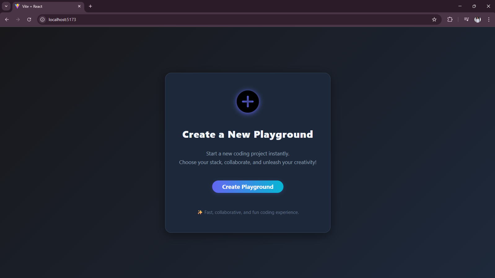
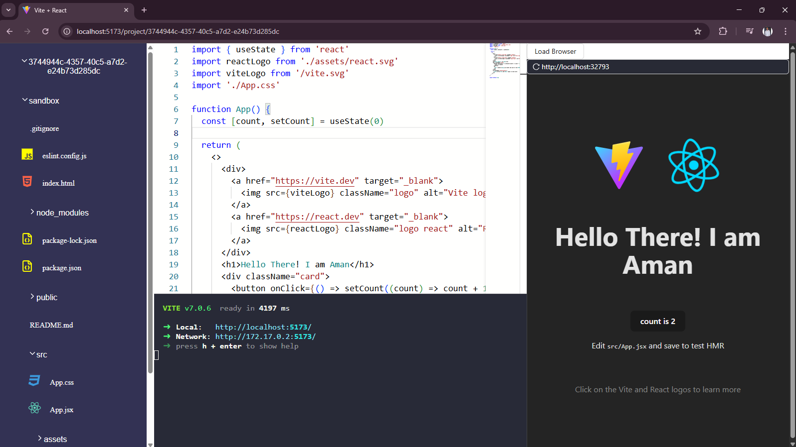
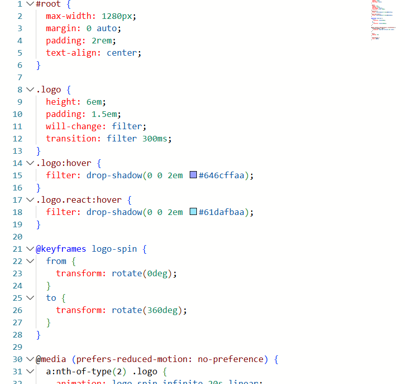
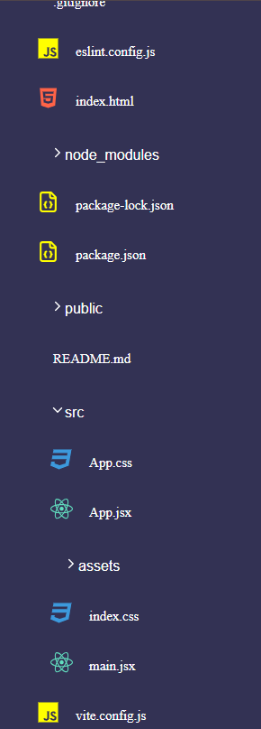
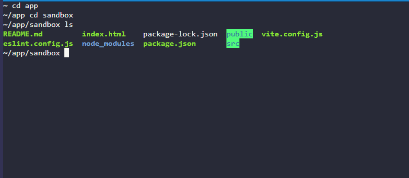

# ⚡ ProjectIDX – Web-Based Code Playground

ProjectIDX is a sleek and responsive full-stack web application that enables developers to create, edit, and run code in real-time right from the browser. Designed for rapid prototyping and collaborative coding, it replicates a true IDE experience in a web environment.

---

## 📌 Overview

- 🛠️ **ProjectIDX** serves as an in-browser coding environment built with React and Vite.
- 🧑‍💻 Features a powerful **code editor**, **integrated terminal**, and **project file explorer**—just like a local IDE.
- 🐳 Backed by **Docker-based containerization** to safely run user code in isolated environments.
- 🎨 Clean and responsive UI using **Ant Design** and custom CSS.
- 🔍 Designed with a modular architecture to support multiple stacks and file structures.

---

## 📸 UI Snapshots

- 🏠 **Home Page** – Launch new playgrounds

- 🌐 **Browser View** – Live server view of the project

- 🧠 **Code Editor** – Monaco-powered editor panel

  
- 📂 **Tree Explorer** – Live file structure viewer

- 🖥️ **Terminal** – Execute commands and see real-time output

---

## 🚀 Features

### 🧾 Code Editor
- Uses **Monaco Editor** (the editor behind VS Code) for a seamless editing experience.
- Real-time syntax highlighting and file editing.
- Supports multi-file project structures.

### 📁 Project Tree Structure
- Displays your folder structure dynamically using `directory-tree`.
- Allows file selection and editing from the UI.
- Encourages organized coding practices similar to local IDEs.

### 💻 Terminal Integration
- Fully interactive terminal running inside **Docker containers**.
- Executes code securely in isolated environments.
- Real-time terminal output using `xterm.js` with add-ons for fit and attach.

### 🌍 Playground Environment
- Start a new project instantly from the home screen.
- Choose your stack (frontend/backend) and jump right into coding.
- Built for speed, collaboration, and experimentation.

### 🔌 Real-time Communication
- WebSocket-based bi-directional communication between client and server.
- Enables live terminal interactions.

---

## 🧱 Tech Stack

### 🔹 Frontend
- `React`, `Vite`, `React Router DOM`, `Zustand` (state management)
- `Monaco Editor`, `Ant Design`, `Allotment` (layout splitter)
- `Socket.io-client`, `Axios`, `React Icons`

### 🔸 Backend
- `Express.js`, `Dockerode`, `Socket.io`, `uuid4`, `directory-tree`
- `cookie-parser`, `dotenv`, `CORS`, `WS` (WebSocket server)

---

## 🐳 Docker + Terminal Execution

Running the terminal inside Docker containers is crucial for:
- ✅ **Security** – Ensures code runs in an isolated environment without affecting the host.
- 🧪 **Consistency** – Maintains identical environments across sessions.
- 🔄 **Scalability** – Easily scale container instances based on active users.
- 🛡️ **Protection** – Prevents direct access to the host system and filesystem.

---

## 🌲 Dynamic Tree View

The dynamic project structure explorer:
- 📁 Visualizes the folder hierarchy using `directory-tree`.
- 🔄 Auto-refreshes with file changes.
- ✏️ Enhances user experience with intuitive navigation and file editing flow.

---

